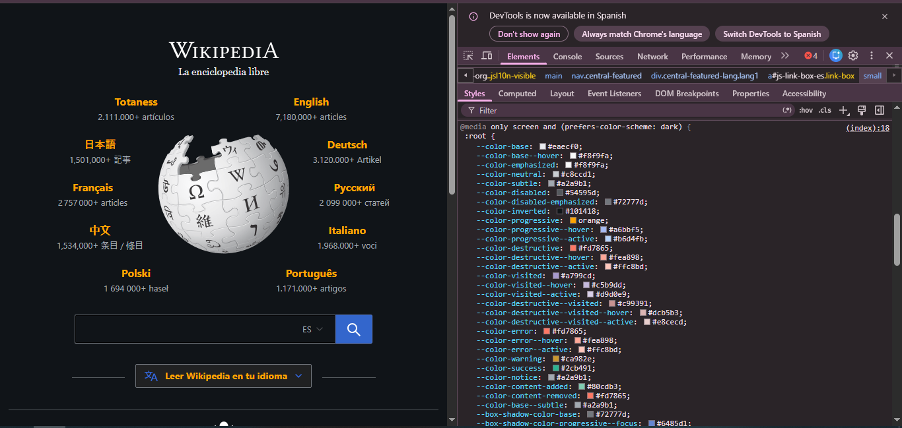
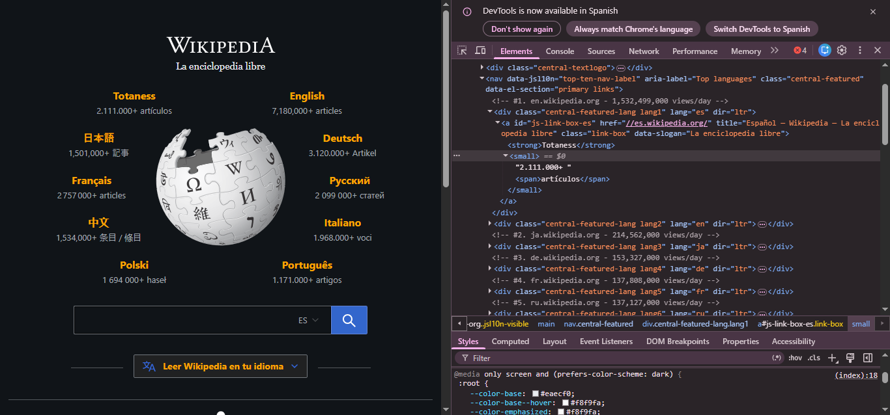
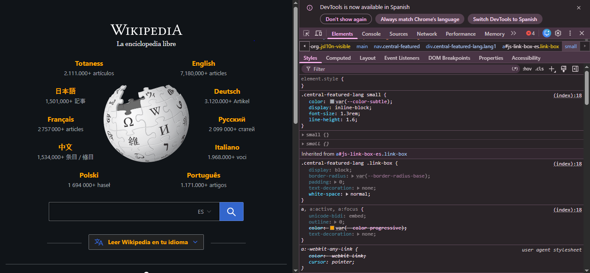
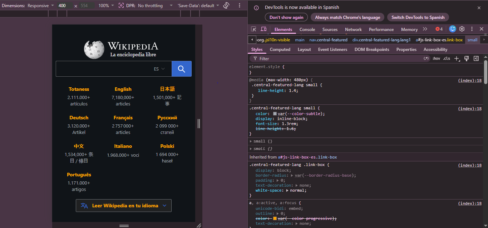

Punto 6

a. 
b. 

c. Los módulos de idioma de Wikipedia están construidos con una estructura HTML organizada y semántica. Cada idioma se encuentra dentro de un `div` que funciona como contenedor y ayuda a posicionarlo en la página mediante clases CSS como `central-featured-lang` y `lang1`. Dentro de ese contenedor hay una etiqueta `a`, que convierte todo el módulo en un enlace clickeable hacia la Wikipedia de ese idioma. Luego se usan etiquetas como `strong` para mostrar el nombre del idioma en negrita y `small` junto con `span` para mostrar información secundaria, como la cantidad de artículos disponibles. Además, atributos como `lang="es"` y `dir="ltr"` indican el idioma y la dirección del texto, mejorando la accesibilidad y el SEO.

d. En la imagen se observa que los módulos de idioma están posicionados y estilizados mediante reglas CSS. La clase `.central-featured-lang` controla la apariencia general de cada bloque, mientras que `.link-box` hace que todo el módulo funcione como un bloque clickeable usando `display: block`. Además, etiquetas como `small` reciben estilos específicos de tamaño, color y separación (`font-size`, `line-height`, `color`) para mostrar la información secundaria, como la cantidad de artículos. La ubicación de cada idioma en la página se logra con clases individuales (`lang1`, `lang2`, etc.), que permiten distribuirlos alrededor del logo central mediante propiedades de posicionamiento en CSS.

e. 

f. 

g. 
    i. El boton de busqueda tiene 64 pixeles con el boton de buscar a lado derecho
    ii. Pues lo unico raro que encuentro es que
        el boton de idioma y busqueda estan unidos 

